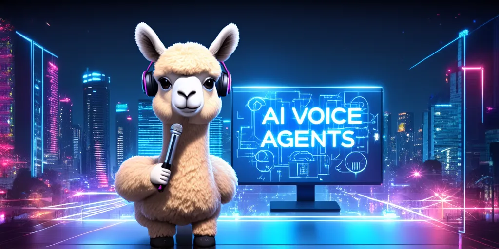

# AI Voice Agents

  

AI Voice Agents - Exploring the Next Generation of Human-Machine Interaction! 🎙️🤖🎧

## Table of Contents

* [Full Stack](#fullstack)
* [Text To Speech](#tts)
* [Automatic Speech Recognition](#asr)
* [Audio Generation](#ag)

## Project List

###  Full Stack

| Source                   | Description                                                 |   Code   |    Paper   |   Model  |
| :------------------------------ | :--------------------------------------------------------------------------------------------------------------------------------------------------------------------------------------------- | :--------------------------------------- | :-----------: | :-------: |
| [GPT-4o](https://openai.com/index/hello-gpt-4o/)               | GPT-4o (“o” for “omni”) is a step towards much more natural human-computer interaction—it accepts as input any combination of text, audio, image, and video and generates any combination of text, audio, and image outputs.      |                   |                   |[API](https://platform.openai.com/docs/models/gpt-4o)    |

<a href="#table-of-contents">^ Back to Contents ^</a>

###  Text To Speech

| Source                   | Description                                                 |   Code   |    Paper   |   Model  |
| :------------------------------ | :--------------------------------------------------------------------------------------------------------------------------------------------------------------------------------------------- | :--------------------------------------- | :-----------: | :-------: |
| [ChatTTS](https://github.com/2noise/ChatTTS)               | ChatTTS is a text-to-speech model designed specifically for dialogue scenario such as LLM assistant.      | [GitHub](https://github.com/2noise/ChatTTS)                       |                   |[Hugging Face](https://huggingface.co/2Noise/ChatTTS)    |

<a href="#table-of-contents">^ Back to Contents ^</a>

